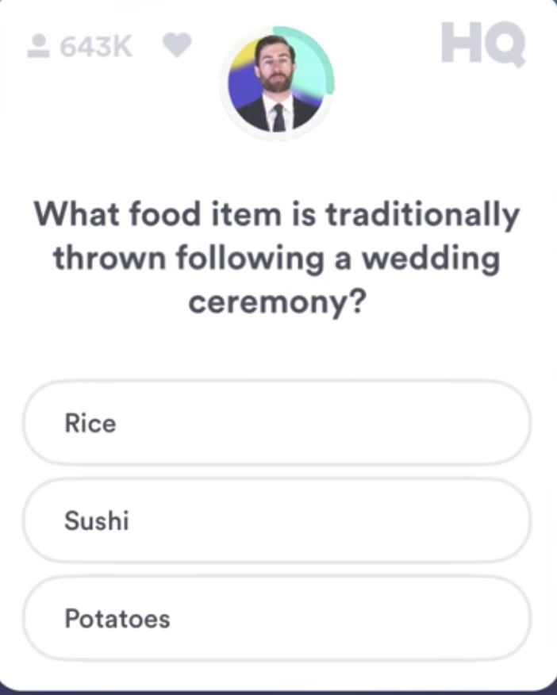

HQ Trivia Hack
===============

**This is for recreational use. Using it in a cash game may be against HQ Trivia's TOS. Use at your own risk**.

[**Demo**](https://youtu.be/R0096uOYFCQ)

## Usage:
1. connect iphone to mac -> Quicktime New Movie Recording

1. for android, use a screen capture app to cast android on mac

2. `python main.py`

3. $$$


## Control flow

- program runs a process to check for screen captures.
- on a screen capture event, the screen shot is processed and Google cloud vision is used to do OCR and process the text.
- text is pruned and searched through a custom Google search engine in 'question + result' format
- results are processed, displayed, and the answer with the highest # hits is read aloud to the user.

### Example

```
Q: What food item is traditionally thrown following a wedding ceremony ?
Rice === SCORE: 9,410,000
Sushi === SCORE: 1,690,000
Potatoes === SCORE: 5,000,000
ANSWER: Rice
```

## Acknowledgements 
Forked from [lishiyo](https://github.com/lishiyo/hqtrivia)

Inspired by [this medium post](https://hackernoon.com/i-hacked-hq-trivia-but-heres-how-they-can-stop-me-68750ed16365)
